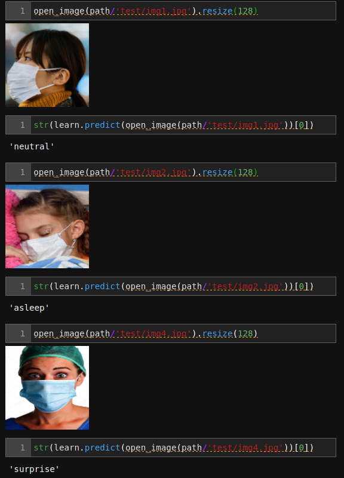

# EMOTION FROM MASKED
- In this age of masks, is it possible to understand someone's basic emotions from covered faces? Maybe just from the eyes? I wanted to try it out with deep learning and I am actually surprised. (None of these images were shown to the model while training.)

- Questions: Is it not obvious? 
- Answer: Maybe. Maybe not. This just shows it is possible to understand emotions just by seeing the eyes and other features.

> (Yes I made the dataset while wearing a mask)

-